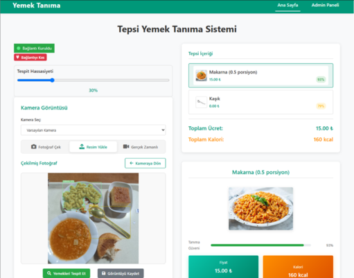
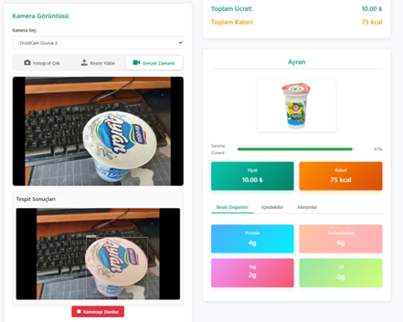
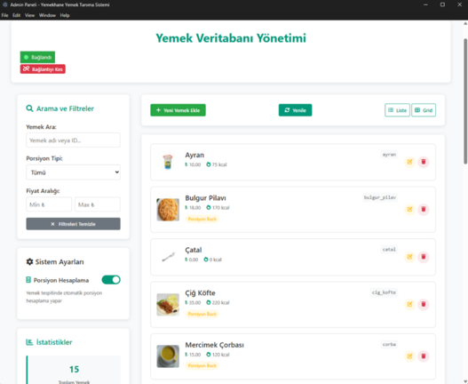
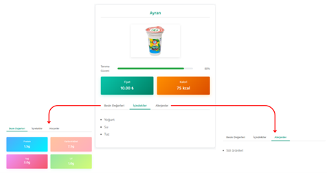

# 🍽️ Yemekhane Yemek Tanıma Sistemi

**Yapay zeka tabanlı akıllı kafeterya çözümü - YOLOv11 ile güçlendirilmiş masaüstü uygulaması**

## 📋 İçindekiler

- [🎯 Proje Hakkında](#-proje-hakkında)
- [✨ Özellikler](#-özellikler)
- [🛠️ Teknolojiler](#️-teknolojiler)
- [📁 Proje Yapısı](#-proje-yapısı)
- [🚀 Kurulum](#-kurulum)
- [🖥️ Kullanım](#️-kullanım)
- [🔧 Konfigürasyon](#-konfigürasyon)
- [🤖 AI Modeli](#-ai-modeli)
- [📊 Veritabanı](#-veritabanı)
- [🎮 Admin Paneli](#-admin-paneli)
- [📸 Ekran Görüntüleri](#-ekran-görüntüleri)
- [📄 Lisans](#-lisans)

## 🎯 Proje Hakkında

Bu proje, kafeterya ve yemekhanelerde kullanılmak üzere geliştirilmiş yapay zeka destekli yemek tanıma sistemidir. YOLOv11 segmentasyon modeli kullanarak tepsi üzerindeki yemekleri gerçek zamanlı olarak tespit eder, porsiyon hesapları yapar ve toplam fiyat ile kalori bilgilerini hesaplar.

### 🎓 Proje Kapsamı
- **Üniversite kafeteryaları** için tasarlanmıştır  
- **Otomatik ödeme sistemi** altyapısı sağlar
- **Besin değerleri takibi** imkanı sunar

## ✨ Özellikler

### 🔍 Yemek Tanıma
- **YOLOv11 Segmentasyon**: Gelişmiş nesne tespiti ve bölütleme
- **Gerçek Zamanlı Tespit**: Canlı kamera akışında anlık tanıma
- **Yüksek Doğruluk**: Ayarlanabilir güven skoru eşikleri
- **Çoklu Yemek Desteği**: Aynı anda birden fazla yemek tespiti

### 📐 Porsiyon Hesaplama
- **Referans Nesne Ölçeklendirme**: Çatal/kaşık ile boyut referansı
- **Hacim Hesaplama**: 3D hacim tahmini algoritmaları
- **Dinamik Porsiyon**: Gerçek boyuta göre porsiyon hesabı
- **Massa Tahmini**: Yoğunluk tabanlı ağırlık hesabı

### 💰 Fiyat ve Besin Hesaplama
- **Otomatik Fiyatlama**: Porsiyon bazlı dinamik fiyatlandırma
- **Toplam Hesaplama**: Tüm yemekler için toplam fiyat/kalori
- **Besin Değerleri**: Protein, karbonhidrat, yağ, lif bilgileri
- **Alerjen Uyarıları**: Potansiyel alerjen madde bildirimleri

### 🎥 Kamera Modları
- **Fotoğraf Modu**: Tek görüntü çekimi ve analizi
- **Dosya Yükleme**: Mevcut görüntüleri yükleme (PNG, JPG, JPEG)
- **Gerçek Zamanlı**: Canlı kamera beslemesi ile sürekli tespit
- **Tespit Dondurma**: Gerçek zamanlı modda sonucu sabitleme

### 🛠️ Admin Paneli
- **CRUD İşlemleri**: Yemek ekleme, güncelleme, silme
- **Arama ve Filtreleme**: Yemek veritabanında hızlı arama
- **İstatistikler**: Veritabanı durumu ve analitik bilgiler
- **Gerçek Zamanlı Güncelleme**: WebSocket ile canlı veri senkronizasyonu

## 🛠️ Teknolojiler

### Frontend
- **Electron**: `v36.0.1` - Cross-platform desktop uygulaması
- **HTML5/CSS3**: Modern web standartları
- **Vanilla JavaScript**: Framework-free JS implementasyonu
- **WebSocket**: Gerçek zamanlı sunucu iletişimi
- **FontAwesome**: İkon kütüphanesi

### Backend  
- **Python**: `v3.9.8` - Ana programlama dili
- **Ultralytics YOLO**: `v8.3.116` - AI model framework
- **OpenCV**: `v4.10.0.84` - Görüntü işleme
- **WebSockets**: `v15.0.1` - Gerçek zamanlı iletişim
- **SQLite**: Hafif veritabanı çözümü
- **PyTorch**: `v2.7.0` - Deep learning framework

### AI ve Görüntü İşleme
- **YOLOv11**: En güncel YOLO segmentasyon modeli
- **Computer Vision**: Gelişmiş görüntü analizi
- **Image Segmentation**: Pixel düzeyinde nesne bölütleme
- **3D Volume Estimation**: Hacim tahmini algoritmaları

## 📁 Proje Yapısı

```
yemekhane-electron-GUI/
├── 📱 src/                          # Frontend (Electron)
│   ├── index.js                     # Electron ana süreç
│   ├── preload.js                   # Güvenli API köprüsü
│   └── renderer/                    # Renderer süreç dosyaları
│       ├── index.html               # Ana sayfa
│       ├── admin.html               # Admin paneli
│       ├── css/                     # Stil dosyaları
│       │   ├── main.css
│       │   ├── base.css
│       │   ├── ui-components.css
│       │   └── pages/
│       ├── js/                      # JavaScript modülleri
│       │   ├── main.js              # Ana JS dosyası
│       │   └── modules/             # Modüler JS yapısı
│       │       ├── websocket_manager.js
│       │       ├── food_detection.js
│       │       ├── camera.js
│       │       ├── admin/
│       │       └── ...
│       └── assets/                  # Statik kaynaklar
│           └── images/foods/        # Yemek görselleri
├── 🤖 YOLO_SERVER/                  # Backend (Python)
│   ├── server.py                    # WebSocket sunucusu
│   ├── model.py                     # YOLO model yönetimi
│   ├── food_processing.py           # Görüntü işleme
│   ├── database.py                  # Veritabanı yönetimi
│   ├── utils.py                     # Yardımcı fonksiyonlar
│   └── config.py                    # Konfigürasyon
├── 📦 package.json                  # Node.js bağımlılıkları
├── ⚙️ forge.config.js               # Electron Forge config
├── 🚀 main.py                       # Python uygulaması başlatıcı
└── 📊 foods.db                      # SQLite veritabanı
```

## 🚀 Kurulum

### Sistem Gereksinimleri
- **İşletim Sistemi**: Windows 10/11, macOS 10.15+, Linux
- **RAM**: Minimum 8GB (16GB önerilen)
- **GPU**: CUDA destekli NVIDIA GPU (opsiyonel, performans için)
- **Disk Alanı**: En az 2GB boş alan
- **Kamera**: USB/webcam (test için)

### 1. Depoyu Klonlayın
```bash
git clone https://github.com/yourusername/yemekhane-electron-GUI.git
cd yemekhane-electron-GUI
```

### 2. Python Ortamını Hazırlayın
```bash
# Anaconda/Miniconda ile
conda create -n yolov11_seg python=3.11
conda activate yolov11_seg

# Requirements'ları yükleyin
pip install ultralytics==8.3.116
pip install opencv-python==4.10.0.84
pip install websockets==15.0.1
pip install pillow
pip install torch torchvision torchaudio
pip install numpy pandas matplotlib
```

### 3. Node.js Bağımlılıklarını Yükleyin
```bash
npm install
```

### 4. YOLO Modelini Hazırlayın
```bash
# Eğitilmiş modeli ana dizine koyun
cp /path/to/your/model.pt my_yolo_model.pt
```

### 5. Veritabanını Başlatın
```bash
# Python ortamında
python -c "from YOLO_SERVER.database import get_database_manager; get_database_manager().init_database()"
```

## 🖥️ Kullanım

### Backend Sunucusunu Başlatma
```bash
# Python ortamını aktifleştirin
conda activate yolov11_seg

# Sunucuyu başlatın
python main.py
```

Sunucu başlatıldığında şu bilgileri göreceksiniz:
```
🚀 YOLO Food Detection System Başlatılıyor...
📊 Veritabanı İstatistikleri:
   • Toplam yemek sayısı: 15
   • Porsiyon bazlı yemekler: 12
   • Sabit porsiyon yemekler: 3
🤖 YOLO modeli yükleniyor...
✅ YOLO modeli başarıyla yüklendi
🌐 WebSocket sunucusu başlatılıyor...
```

### Frontend Uygulamasını Başlatma
```bash
# Yeni terminal açın
npm start
```

## 🔧 Konfigürasyon

### Backend Ayarları (`YOLO_SERVER/config.py`)
```python
# WebSocket sunucu ayarları
HOST = "localhost"
PORT = 8765

# YOLO model ayarları  
DEFAULT_CONFIDENCE_THRESHOLD = 0.5
DEFAULT_IOU_THRESHOLD = 0.45
DEFAULT_IMAGE_SIZE = 640

# Referans nesne boyutları (cm)
REFERENCE_OBJECTS = {
    "catal": {"length": 19.5, "width": 2.5, "area": 48.75},
    "kasik": {"length": 19.5, "width": 4.5, "area": 87.75}
}
```

## 🤖 AI Modeli

### Model Mimarisi
- **YOLOv11 Segmentation**: En güncel YOLO mimarisi
- **Input Size**: 640x640 pixels
- **Output**: Bounding boxes + segmentation masks
- **Classes**: Özel eğitilmiş yemek sınıfları

### Desteklenen Yemek Sınıfları
Bu projede desteklenen yemek kategorileri:
- Ana yemekler (tavuk, et yemekleri)
- Yan yemekler (pilav, makarna)
- Çorbalar (mercimek çorbası, vs.)
- Salatalar ve mezeler
- İçecekler (su, ayran)
- Ekmek ve tahıllar
- Referans nesneler (çatal, kaşık)

## 🎮 Admin Paneli

Admin paneli üzerinden aşağıdaki işlemler yapılabilir:

### Yemek Yönetimi
- ➕ **Yeni Yemek Ekleme**: Tüm bilgilerle birlikte
- ✏️ **Mevcut Yemek Güncelleme**: Fiyat, kalori, besin değerleri
- 🗑️ **Yemek Silme**: Güvenli silme işlemi
- 🔍 **Arama ve Filtreleme**: Hızlı yemek bulma

### Veri Girişi Formları
- **Temel Bilgiler**: İsim, fiyat, kalori
- **Porsiyon Ayarları**: Porsiyon bazlı fiyatlandırma
- **Besin Değerleri**: Protein, karbonhidrat, yağ, lif
- **Ek Bilgiler**: Malzemeler, alerjenler

### İstatistik Paneli
- Toplam yemek sayısı
- Porsiyon bazlı yemek oranı  
- Fiyat ve kalori aralıkları
- Kategori dağılımları

## 📸 Ekran Görüntüleri

### Ana Sayfa


*Yemek tanıma ana ekranı - kamera modları ve sonuç paneli*

### Gerçek Zamanlı Tespit
  

*Canlı kamera beslemesinde gerçek zamanlı yemek tespiti*

### Admin Paneli


*Yemek veritabanı yönetim paneli*

### Sonuç Detayları


*Tespit edilen yemekler için detaylı bilgi ekranı*

## ⚠️ Lisans ve Sorumluluk Reddi

Bu proje eğitim amaçlı geliştirilmiş bir bitirme projesidir. Ticari kullanımdan önce aşağıdaki hususlar dikkate alınmalıdır:

- Yemek tespit doğruluğu %100 değildir
- Alerjen bilgileri kesin olmayabilir  
- Fiyat hesaplamaları tahmin niteliğindedir
- Ticari kullanım için ek testler gereklidir

## 👨‍💻 Geliştirici

**Blu3Line (Celal Erkuş)**
- 📧 Email: celal.erkuss@gmail.com
- 🐙 GitHub: [@blu3line](https://github.com/blu3line)
- 💼 LinkedIn: [Celal Erkuş](https://linkedin.com/in/celal-erkus)

---